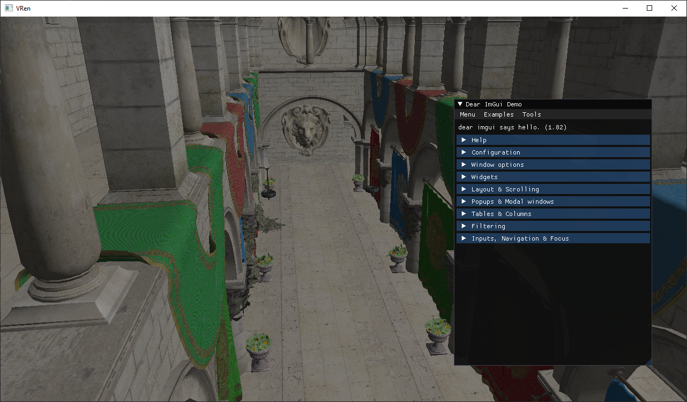
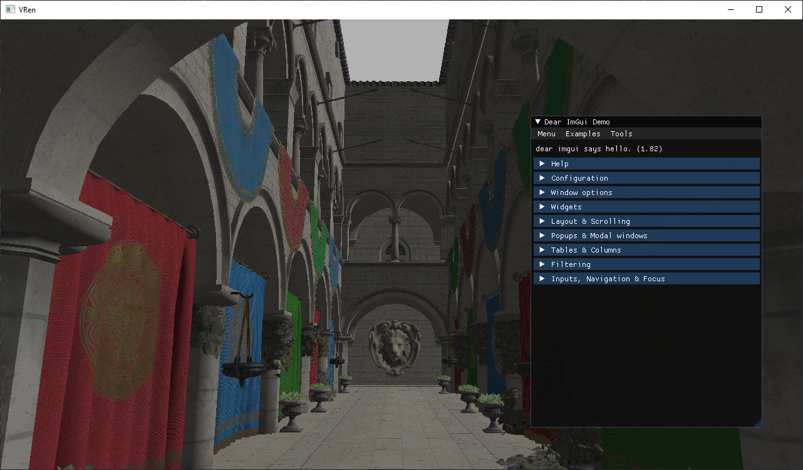
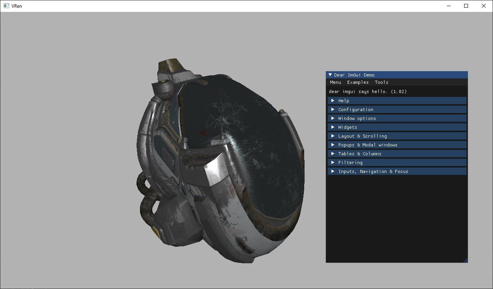

# VREN

VREN (a creative abbreviation for "my Vulkan RENderer") is a 3D rendering library that makes use of the low-level graphics library Vulkan.

It's being written mainly for learning puposes.

## Directory structure
- `docs`: github-pages website 
- `vren`: the basic_renderer's library code
- `vren_demo`: the demonstration executable code meant to show off the features of vren
- `vren_test`: unit tests

## How to build

Ensure the following requirements are satisfied:
- git
- [CMake](https://cmake.org/download/) >= 3.19
- [vcpkg](https://github.com/microsoft/vcpkg)
- [Vulkan SDK](https://vulkan.lunarg.com/) >= 1.2 _- also make sure `VULKAN_SDK` is set and points to the correct installation folder_

Clone this repository and navigate into it:
```cmd
git clone https://github.com/loryruta/vren
cd vren
```

Generate the project build configuration through CMake:
```cmd
mkdir build
cd build
cmake .. -DCMAKE_TOOLCHAIN_FILE=<vcpkg home directory>/scripts/buildsystems/vcpkg.cmake
```

Build it:
```cmd
cmake --build .
```

You may want to run the demo executable at: `./build/vren_demo/vren_demo(.exe)`.

## Gallery 






