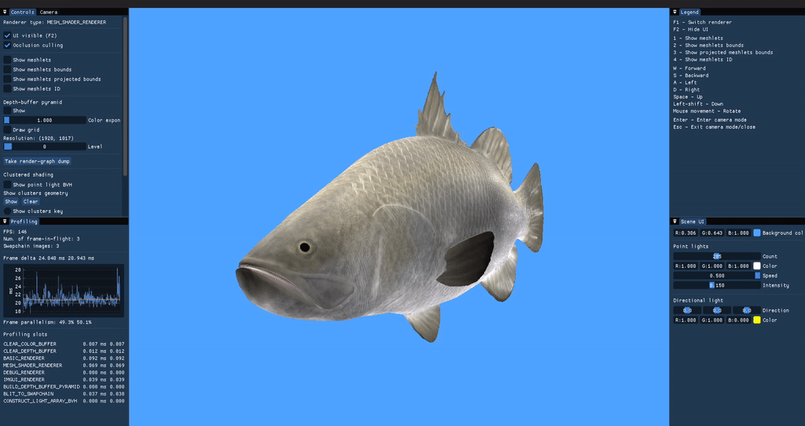

# vren

vren (whose name stands for "**V**ulkan **ren**derer") is a 3D rendering library.
At the moment it's where I'm experimenting several rendering techniques and put my effort in designing a clean overlay over the Vulkan API.



## Features

- Model loading (.gltf and .obj)
- Lighting (point lights and directional lights)
- Physically-Based Rendering (PBR)
- Vertex pipeline renderer (deferred)
- Mesh clusterization ([meshoptimizer](https://github.com/zeux/meshoptimizer) backend)
- Mesh shader renderer (deferred)
- Occlusion culling
- Clustered shading
- Debug renderer (lines, cubes, spheres, overlay text ...)
- UI and plots renderer (ImGui and ImPlot)
- Render-graph architecture
- Parallel computing primitives (Reduce, ExclusiveScan, RadixSort, BucketSort, BuildBVH ...)
- GPU profiler

## Using vren in your project (CMake)

If your project is CMake-based then using vren is trivial.

Write the following in your `CMakeLists.txt`:
```cmake
include(FetchContent)

FetchContent_Declare(
        vren
        GIT_REPOSITORY https://github.com/loryruta/vren
        GIT_TAG        <gh-tag>
)
FetchContent_MakeAvailable(vren)

target_link_libraries(<your-project> PRIVATE vren)

include("${vren_SOURCE_DIR}/VRen.cmake")
setup_resources(<your-project>)
```

## How to use the API

Unfortunately this is still an early project so there is no official documentation available yet. If you're interested in using it anyway, then I suggest you to have a look at the [demo executable's code](https://github.com/loryruta/vren/tree/master/vren_demo/vren_demo). 

## How to build

#### Requirements

- C++ >= 20
- git
- [CMake](https://cmake.org/download/) >= 3.19
- [vcpkg](https://github.com/microsoft/vcpkg)
- [Vulkan SDK](https://vulkan.lunarg.com/) 1.3.x

#### Build it

```cmd
git clone https://github.com/loryruta/vren
cd vren

mkdir build
cd build
cmake .. -DCMAKE_TOOLCHAIN_FILE=<vcpkg home directory>/scripts/buildsystems/vcpkg.cmake
cmake --build .
```

You may want to run the demo executable (ensure `.vren` and `resources` folders are in the same directory):
```cmd
vren_demo <gltf-or-glb-model-file>
```
